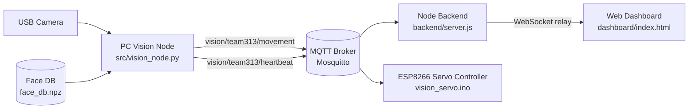
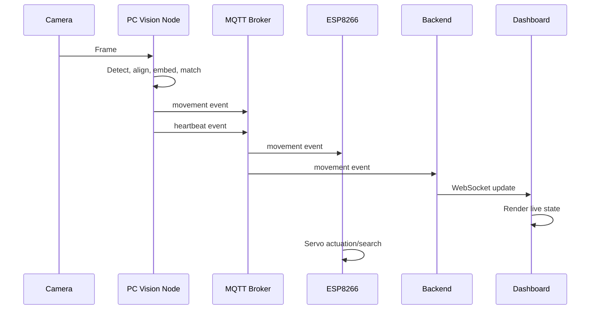
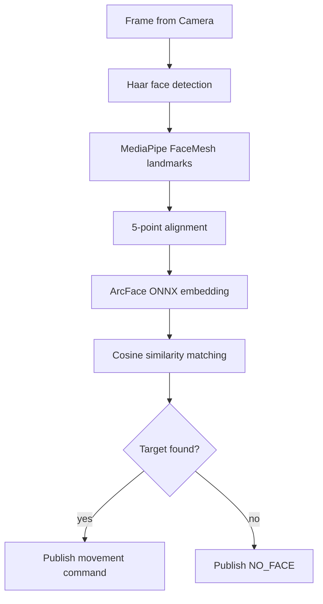
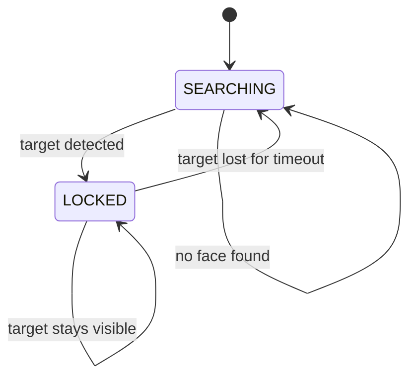
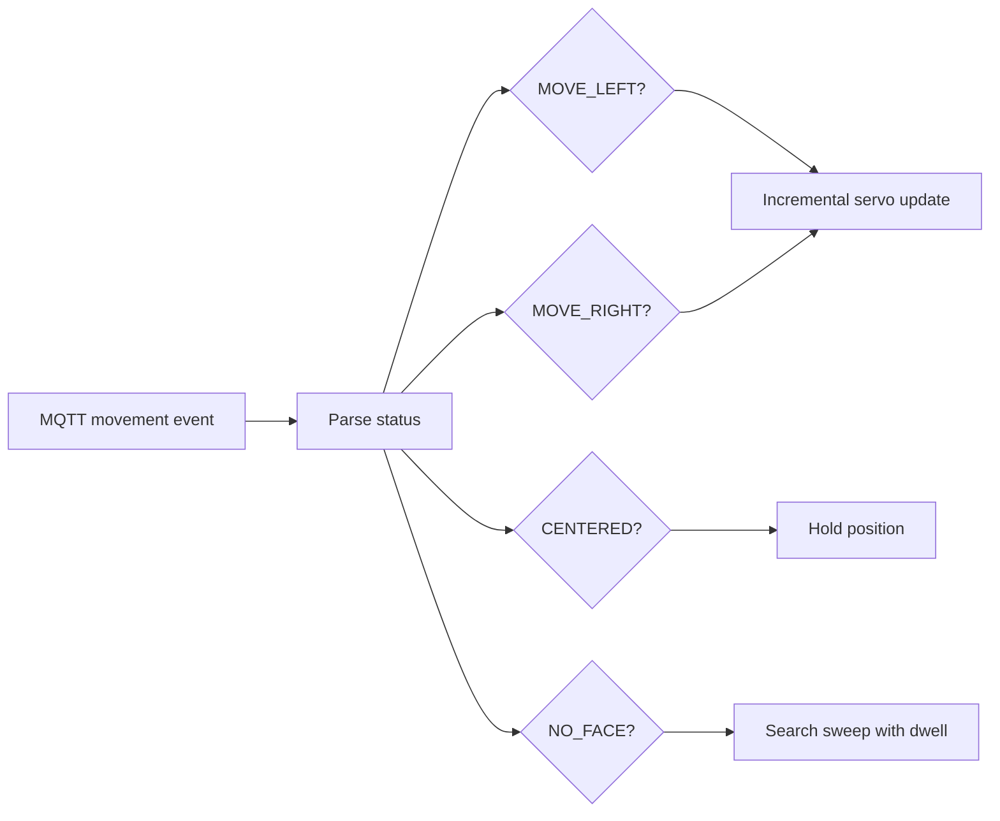
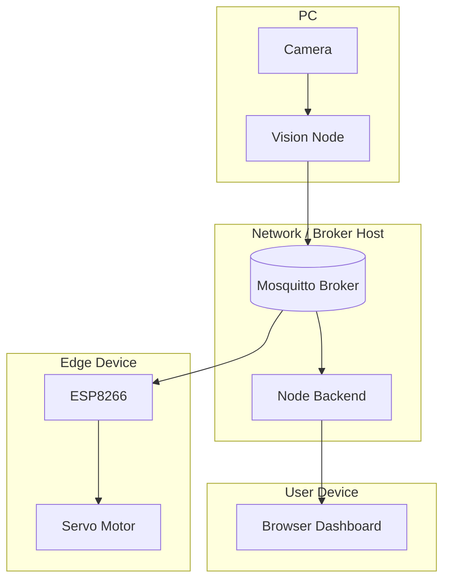
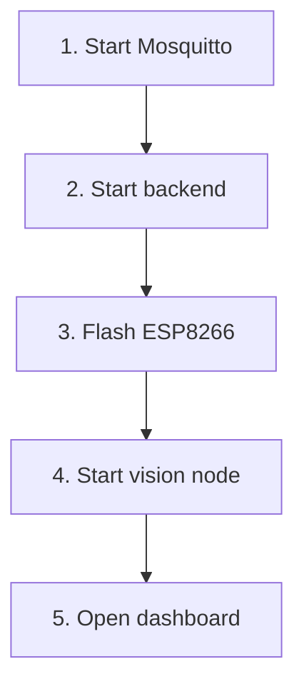

# System Architecture

This document describes the full runtime architecture of the project, including the data flow between the camera, PC vision node, MQTT broker, backend, dashboard, and ESP8266 controller.

## 1. High-Level Overview

The system is divided into three runtime planes:

- Perception on the PC
- Message transport through MQTT and WebSocket
- Actuation on the ESP8266



## 2. Component Roles

### 2.1 PC Vision Node

The PC vision node is the perception and decision layer.

Responsibilities:

- Capture frames from the camera.
- Detect faces using Haar + MediaPipe FaceMesh.
- Align the target face using 5-point landmarks.
- Compute ArcFace embeddings.
- Match the embedding against the enrolled database.
- Decide the motion command:
  - `MOVE_LEFT`
  - `MOVE_RIGHT`
  - `CENTERED`
  - `NO_FACE`
- Publish movement and heartbeat messages to MQTT.

Relevant files:

- [src/vision_node.py](src/vision_node.py)
- [src/face_locking.py](src/face_locking.py)
- [src/haar_5pt.py](src/haar_5pt.py)
- [src/recognize.py](src/recognize.py)

### 2.2 MQTT Broker

The broker is the shared transport bus.

Responsibilities:

- Accept publishes from the PC vision node.
- Deliver movement commands to the ESP8266.
- Deliver movement events to the backend for dashboard display.
- Carry heartbeat/status messages.

### 2.3 Node Backend

The backend is the web relay and dashboard host.

Responsibilities:

- Subscribe to MQTT movement events.
- Forward them to browser clients over WebSocket.
- Serve the dashboard HTML over HTTP.

Relevant files:

- [backend/server.js](backend/server.js)
- [backend/package.json](backend/package.json)

### 2.4 Web Dashboard

The dashboard is a browser UI for monitoring.

Responsibilities:

- Display the current movement command.
- Show lock/search state.
- Display the face snapshot when available.
- Show live connection status and logs.

Relevant file:

- [dashboard/index.html](dashboard/index.html)

### 2.5 ESP8266 Servo Controller

The ESP8266 is the actuation layer.

Responsibilities:

- Subscribe to movement commands over MQTT.
- Move the servo to follow the face.
- Enter a search pattern when the target disappears.
- Publish heartbeat messages.

Relevant file:

- [esp8266/vision_servo/vision_servo.ino](esp8266/vision_servo/vision_servo.ino)

## 3. Runtime Data Flow



### Step-by-step

1. The camera sends a frame to the PC vision node.
2. The vision node finds faces and aligns the target.
3. The aligned crop is embedded with ArcFace.
4. The embedding is matched against `face_db.npz`.
5. The result becomes a movement command.
6. The MQTT broker distributes the command.
7. The ESP8266 moves the servo.
8. The backend forwards the same data to the dashboard.
9. The dashboard renders the current state for the user.

## 4. Message Contracts

### 4.1 Movement Topic

Topic:

- `vision/team313/movement`

Payload fields:

- `status`: one of `MOVE_LEFT`, `MOVE_RIGHT`, `CENTERED`, `NO_FACE`
- `confidence`: match or tracking confidence
- `target`: enrolled identity name
- `locked`: boolean lock state
- `timestamp`: Unix timestamp
- `face_image`: optional base64 JPEG snapshot

Example:

```json
{
  "status": "MOVE_LEFT",
  "confidence": 1.0,
  "target": "andrew",
  "locked": true,
  "timestamp": 1718222400.12
}
```

### 4.2 Heartbeat Topic

Topic:

- `vision/team313/heartbeat`

Payload fields:

- `node`
- `status`
- `timestamp`

Example:

```json
{
  "node": "pc_vision",
  "status": "ONLINE",
  "timestamp": 1718222400.12
}
```

## 5. Vision Pipeline



### Notes

- Haar is used as a fast first pass.
- MediaPipe FaceMesh provides stable keypoints.
- ArcFace embeddings are compared against the enrolled database.
- The face locking layer keeps the system focused on one target identity.

## 6. Search and Tracking State

The tracking logic has two broad states:

- `SEARCHING`
- `LOCKED`



### SEARCHING

- The system scans for the target identity.
- If the target is lost, the ESP8266 can enter a servo search sweep.

### LOCKED

- The system tracks the current target.
- Servo commands are issued based on the target center position.

## 7. ESP8266 Actuation Model



### Search behavior

- When `NO_FACE` is received, the servo enters a search pattern.
- The search pattern steps through multiple angles.
- The servo now dwells at each angle before moving to the next one.
- Movement is smoothed so the motor does not jump aggressively.

## 8. Deployment Topology



### Practical deployment options

- Local test setup:
  - broker, backend, vision node, and dashboard can run on one machine.
- Split deployment:
  - broker/backend on a VPS
  - vision node on a PC
  - ESP8266 on the local network

## 9. Startup Order



Recommended runtime order:

1. Start the MQTT broker.
2. Start the backend.
3. Flash and power the ESP8266.
4. Start the PC vision node.
5. Open the dashboard in a browser.

## 10. Failure and Recovery Paths

### Broker unavailable

- Vision node cannot publish movement.
- ESP8266 cannot receive tracking commands.
- Dashboard stops receiving updates.

### Target not enrolled

- The vision node warns that the identity is missing from the database.
- Locking will not work reliably until enrollment is completed.

### Camera unavailable

- The PC vision node cannot capture frames.
- The system must be started with a valid camera index.

### ESP8266 loses Wi-Fi or MQTT

- The servo stops receiving commands.
- Reconnect logic should recover automatically once the broker is reachable again.

## 11. Data Artifacts

- `data/db/face_db.npz`
  - stores enrolled identity embeddings
- `data/db/face_db.json`
  - metadata for the enrollment database
- `<name>_history_<timestamp>.txt`
  - action log created by the face-locking system

## 12. Design Summary

This architecture separates perception, transport, presentation, and actuation:

- Perception stays on the PC for compute-heavy vision work.
- MQTT provides lightweight message distribution.
- The backend exists only to bridge MQTT into the browser.
- The ESP8266 handles only the servo and search logic.

That separation keeps the system modular and makes each part easier to deploy or replace independently.
