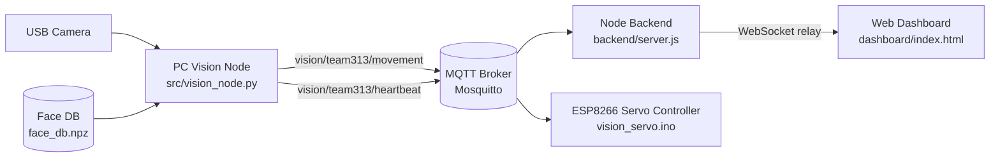

# Face Recognition with ArcFace ONNX and 5-Point Alignment


**Author:** Mugisha Prosper  
**Instructor:** Gabriel Baziramwabo  
**Organization:** Rwanda Coding Academy  

This project implements a **Distributed Face Recognition and Tracking System** for IoT-based servo control using:

- **ArcFace** model (ONNX) for face recognition
- **5-point facial landmark alignment** for precise face detection
- **MQTT** for distributed communication between components
- **ESP8266** microcontroller for edge-based servo control
- **Real-time Web Dashboard** for system monitoring

The system is designed for **embedded systems applications**, demonstrating how computer vision, IoT communication, and edge computing work together in a practical face-tracking servo control system.

## Table of Contents

- [Assessment Details (Week 06)](#assessment-details-week-06)
- [System Architecture](#system-architecture)
- [Features](#features)
- [Project Structure](#project-structure)
- [Quick Start](#quick-start)
- [Usage](#usage)

## System Architecture

This system uses a distributed, message-driven architecture:



### Components

1. **PC Vision Node**
   - Captures camera frames.
   - Detects faces, aligns them, and matches identities with ArcFace embeddings.
   - Decides whether the target is moving left, right, centered, or absent.
   - Publishes MQTT messages for movement and heartbeat.

2. **MQTT Broker**
   - Central transport layer for all runtime communication.
   - Carries movement commands from the vision node to the ESP8266.
   - Carries status events such as heartbeat messages.

3. **Node Backend**
   - Subscribes to MQTT movement messages.
   - Relays them to browser clients over WebSocket.
   - Serves the dashboard HTML.

4. **Web Dashboard**
   - Displays current tracking status, lock state, and face snapshot.
   - Connects to the backend over WebSocket.

5. **ESP8266 Servo Controller**
   - Subscribes to movement commands from MQTT.
   - Drives the servo motor to follow the detected target.
   - Switches into search mode when the target is lost.

### Runtime Data Flow

1. The camera frame is read by the PC vision node.
2. The face is detected and aligned.
3. The identity is matched against the enrollment database.
4. The vision node publishes movement commands to MQTT.
5. The ESP8266 receives those commands and moves the servo.
6. The backend forwards the same movement events to the dashboard.
7. The dashboard renders the live state for monitoring.

## Features

- **Face Recognition & Locking**: Lock onto a specific enrolled identity and track their movements
- **Distributed Architecture**: Components communicate via MQTT, allowing flexible deployment
- **Real-time Servo Control**: ESP8266 controls servo motor based on face position
- **Live Dashboard**: Web-based monitoring with WebSocket updates
- **Action Detection**: Detects blinks, smiles, and head movements
- **CPU-friendly**: Runs on standard laptops without GPU requirements

## Project Structure

```
Face_recognition_with_Arcface/
├── src/
│   ├── vision_node.py       # Main vision processing + MQTT publisher
│   ├── face_locking.py      # Face locking & action detection
│   ├── haar_5pt.py          # Face detection core
│   └── recognize.py         # ArcFace recognition
├── backend/
│   ├── server.js            # MQTT-to-WebSocket relay
│   └── package.json
├── dashboard/
│   └── index.html           # Real-time web dashboard
├── esp8266/
│   └── vision_servo/
│       └── vision_servo.ino # Arduino firmware for ESP8266
├── data/
│   └── db/                  # Face database (face_db.npz)
└── models/
    └── embedder_arcface.onnx
```

## Quick Start

### 1. Install Dependencies
```bash
pip install -r requirements.txt
cd backend && npm install
```

### 2. Enroll Your Face
If `models/embedder_arcface.onnx` is missing, download the recommended
InsightFace ArcFace recognition model first:

```bash
python scripts/download_arcface_model.py
```

The default is `antelopev2` from the official InsightFace `v0.7` model-package
release, extracting `glintr100.onnx` to `models/embedder_arcface.onnx`.

```bash
python -m src.enroll --name andrew
```

### 3. Run the System

Follow this order so the components connect cleanly:

1. **Start the MQTT broker**
   - On the VPS or the machine running Mosquitto:
   ```bash
   mosquitto -c mosquitto.conf
   ```

2. **Start the Node backend**
   - In a second terminal on the backend machine:
   ```bash
   cd backend
   npm run dev
   ```
   - This starts the MQTT-to-WebSocket relay and serves the dashboard page.

3. **Flash the ESP8266 firmware**
   - Open `esp8266/vision_servo/vision_servo.ino` in Arduino IDE.
   - Select the correct board and serial port.
   - Update the Wi-Fi SSID/password and MQTT broker IP in the sketch if needed.
   - Upload the sketch to the ESP8266.
   - You can flash it before or after the other services, but it must be able to reach the broker once powered.

4. **Start the PC vision node**
   - In the project root:
   ```bash
   python src/vision_node.py --broker 157.173.101.159 --name andrew
   ```
   - Replace `andrew` with the enrolled identity you want to track.

5. **Open the dashboard**
   - In a browser, open:
   - `http://157.173.101.159:8080/`

## Assessment Details (Week 06)

### System Description
This project implements a **Distributed Face Recognition and Locking System** using:
1.  **Vision Node (PC)**: Detects, recognizes, and tracks faces using ArcFace and MediaPipe. Publishes movement commands.
2.  **MQTT Broker (VPS)**: Facilitates communication between the PC, ESP8266, and Dashboard.
3.  **ESP8266 (Edge)**: Subscribes to movement commands and controls a Servo motor to track the face.
4.  **Web Dashboard**: Visualizes the real-time blocking status and tracking info.

### MQTT Topics
-   `vision/team313/movement`: JSON payload with `status` (MOVE_LEFT, MOVE_RIGHT, CENTERED), `target`, and `locked` state.
-   `vision/team313/heartbeat`: System health status.

### Live Dashboard
**URL**: [http://157.173.101.159:8080/]

## Face Locking
The new Face Locking feature (`src/face_locking.py` and `vision_node.py`) allows you to track a single enrolled identity continuously.

**How it works:**
1.  **Search**: The system looks for the user using ArcFace recognition.
2.  **Lock**: Once found, it tracks the user's face position.
3.  **Action Detection**: It measures facial landmarks to detect:
    - **Blinks**: Using Eye Aspect Ratio (EAR).
    - **Smiles**: Using mouth width ratios.
    - **Movement**: Using nose position (Left/Right).

**History**:
A file named `<name>_history_<timestamp>.txt` is created to record all detected actions.
